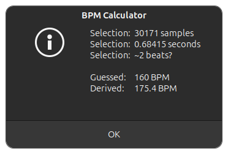
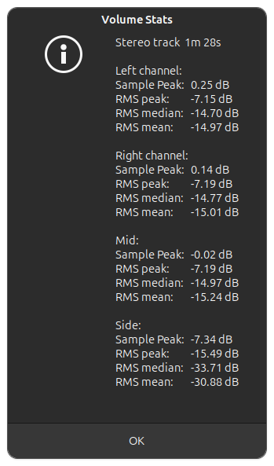
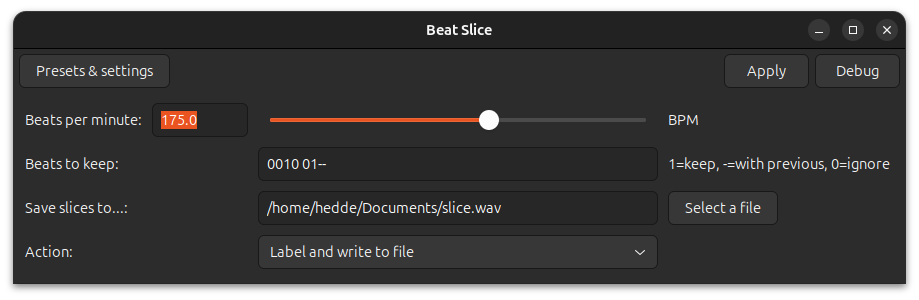
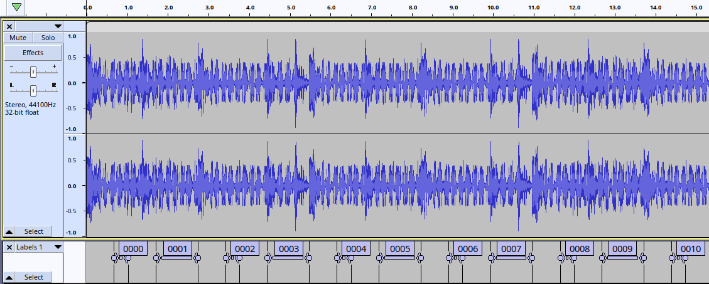

# Sgorpi's audacity nyquist plugins

This is a collection of some nyquist plugins made for audacity. They originate from needs I had in my audio journey.

## BPM calculator

- in `sgorpi_bpm_calc.ny` 

Is a plugin that requires the user to make an exact selection of beats, and input a guess to the BPM of the selection. Based on the number of samples and samplerate, together with an estimated number of beats according to the input BPM, this plugin returns the exact BPM.

## Volume Stats

- in `sgorpi_stats.ny`

Provides some basic volume statistics on the selected audio:
- absolute peak signal found
- peak RMS
- average RMS
- median RMS

For stereo audio it will output not only left/right but also mid/side statistics.

## Beat Slice

- in `sgorpi_slice.ny`

Allows the user to either label or export specific sections of the selected audio. For example, this allows you to export every 4th beat in a recording to separate audio files.

The user can input BPM, the pattern of beats they want to keep/ignore, an output location, and an action (label and/or output to file)

With labeling selected, the pattern of beats given as input is labeled:

